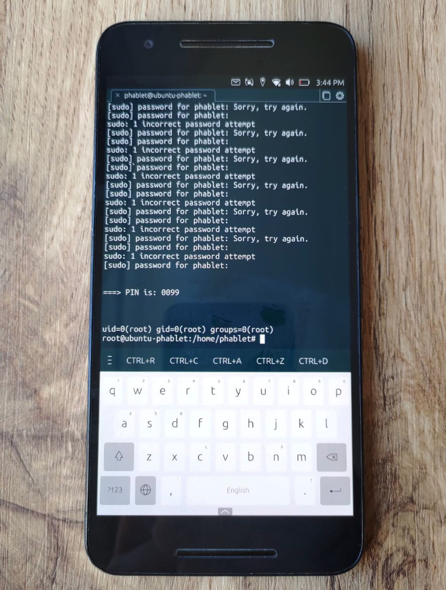
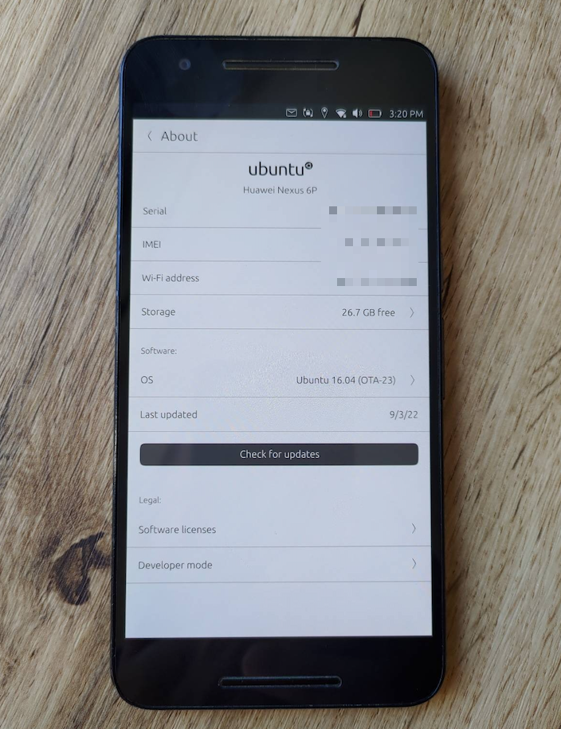

[UPDATE 09.09.2022] I got new CVE for this vulnerability: [CVE-2022-40297](https://cve.mitre.org/cgi-bin/cvename.cgi?name=CVE-2022-40297).

## Proof of Concept: Privilege escalation in Ubuntu Touch 16.04 - by Passcode Bruteforce 

Ubuntu Touch allows you to "protect" devices with a 4-digit passcode. Such a code was set in a demonstration device. The problem is that the same 4-digit passcode then 
becomes a password that we can use with the sudo command and gain root privileges.

This means that a malicious application can do us double harm:
1. Easily escalate privileges and take control of the device.
2. It can pass the screen unlock passcode to a third party.

## How does my Proof of Concept work?

1. We run poc.py as a regular user.
2. App is doing bruteforce attack on password. No rate limit in system!
3. Passcode to unlock the screen = password for sudo su to obtain root.
4. After 1-2 minutes we have passcode on the screen, which we also save to the file /root/passcode as evidence of system compromise.

## Contact

Feel free to contact me on [Twitter @FilipKarc](https://twitter.com/FilipKarc).

Be sure to follow me on LinkedIn: [LinkedIn](https://www.linkedin.com/in/filip-karczewski/).

  
